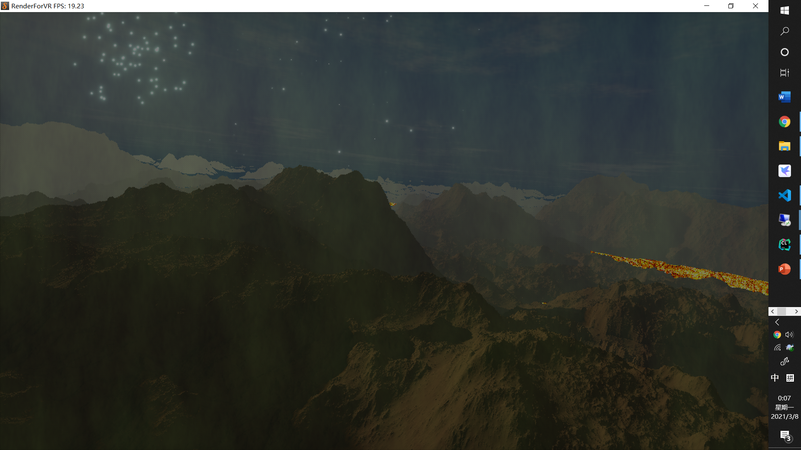

# Technical documentation description (rendering of large-scale volcano scenes)

# Li Yuan

# The final implementation result (non-stereoscopic version)

There are 5 different effects

1\. Terrain (based on perlinnoise implementation)

2\. Fireworks (based on the simplest particle system implementation)

3\. Smoke (based on noise\+analytic gradient implementation)

4\. magma (based on physx implementation failed, and finally implemented based on noise\+analytic gradient)

5\. clouds \(based on analytical gradient and noise implementation)

# The difficulty of implementation

1\. Elegant implementation of the math library (after multiple refactorings, util/EigenLidan\,Matrix\.h...\)

2\. Elegant implementation based on opengl pipeline (opengl/\*)

3\. Realization of ray tracing based on glsl (matching of terrain, clouds, etc.)

4\. Support interactive (but only click to set off fireworks)

5\. Simple fireworks particle system (no physics engine, just use shader to simulate the relationship between gravity and speed)

Matching to the teacher's requirements: 1\. 5 plants \( Match: see previous page), 2\. Physics engine (not used, but simulated the simplest fireworks particle system), 3\. Interactive (fireworks). 

# The final VR effect (because opengl's stereo vision is very simple) (use red and blue eyes to watch)

# original effect

# stereo vision

# Summarize

1\. In summary, basically fulfill the teacher's requirements

2\. Advantages: I am most satisfied with the elegant implementation of the math library and opengl pipeline. And the first contact, use noise and noise's analytical gradient to construct terrain and other objects, and use path tracing to render these objects. An implementation of stereo vision is provided.

3\. Disadvantages: No physics engine is used, but a particle system is simply implemented. Interactivity is all about setting off fireworks.

# reference

1\.[http://iquilezles\.org/www/articles/morenoise/morenoise\.htm\(noise](http://iquilezles.org/www/articles/morenoise/morenoise.htm(noise) function and Noise analytical gradient calculation, analytical gradient can help to quickly calculate the normal vector)

[2\.](http://iquilezles.org/www/articles/rmshadows/rmshadows.htm)[http://iquilezles\.org/www/articles/rmshadows/rmshadows\.htm](http:// iquilezles.org/www/articles/rmshadows/rmshadows.htm) (Implementation of soft shadows in finite ray tracing)

3\.[http://iquilezles\.org/www/articles/fog/fog\.htm](http://iquilezles.org/www/articles/fog/fog.htm)\(fog calculation, and smoke calculation)

4\. Software noise lab, (provide valued noise, perlinnoise and other 2d noise implementation demos)

5\. Magma noise implementation ([https://www\.shadertoy\.com/view/lslXRS](https://www.shadertoy.com/view/lslXRS))

The above blog posts and software have helped me a lot in my experiments.

# experience

Noise plus analytical gradient can render anything you want, as long as you write the raymatch function.
